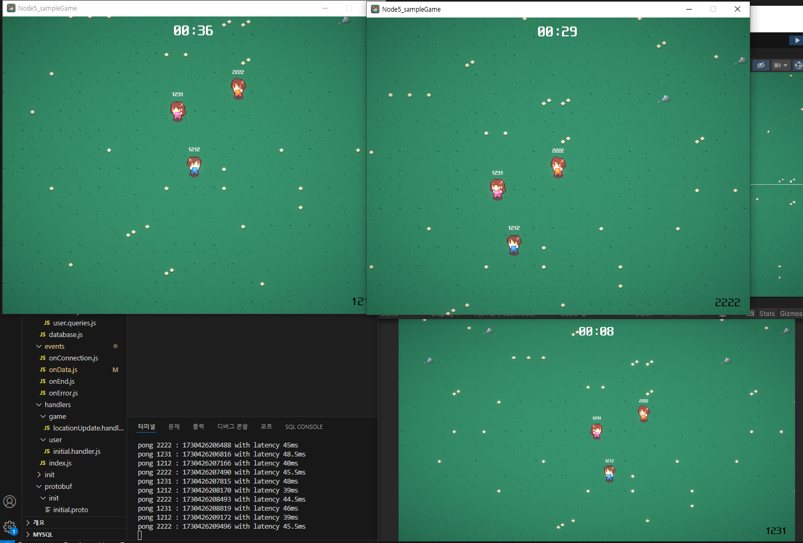

# TCP 멀티플레이어 게임 서버 만들기

[내일배움캠프] 스파르타) Chapter5 게임서버 주특기 플러스 개인과제

# 1. 프로젝트 세팅

`npm init -y`
`npm install dotenv lodash long mysql2 protobufjs uuid`
`npm install -D nodemon prettier`

### dotenv

- `dotenv`는 환경 변수를 `.env` 파일에 저장하고 이를 Node.js 애플리케이션에 로드
- 개발자가 코드에서 직접 환경 변수를 설정하는 대신 별도의 파일로 관리할 수 있게 해 줍니다.

### lodash

- JavaScript의 유틸리티 라이브러리
- 배열, 객체, 함수 등의 데이터 처리를 위한 다양한 기능을 제공
- 성능이 뛰어나고 코드의 가독성을 높이는 데 유용

### long

- 64비트 정수를 지원하는 라이브러리
- JavaScript는 기본적으로 64비트 정수를 지원하지 않기 때문에, 이 라이브러리를 통해 64비트 정수를 다룰 수 있습니다.

### mysql2

- MySQL 데이터베이스와 상호 작용하기 위한 Node.js 클라이언트 라이브러리

### protobufjs

- Google의 Protocol Buffers(프로토콜 버퍼)를 사용하여 데이터 직렬화 및 역직렬화를 지원하는 라이브러리

### uuid

- 고유한 식별자(UUID)를 생성하기 위한 라이브러리
- 다양한 버전의 UUID를 지원

# 2. 들어가 있는 내용

- 프로젝트 전체 구조부터 시작해서 패킷
- 구조 설계
- 교환
- 세션
- DB
- 게임 및 유저 인스턴스 객체화
- 인스턴스 관리
- 상태 동기화
- 레이턴시 관리
- 레이턴시 마스킹

# 3. 포함 내용

- 중앙 집중식 관리
- 소켓 이벤트 분리
- 프로토 파일 로드
- 패킷 파싱
- 핸들러
- 세션
- 패킷 검증
- 에러 핸들링
- DB 연동
- DB 마이그레이션
- 유저 데이터 저장
- 객체지향 패턴
- 비즈니스 로직
- RTT
- 인터벌 매니저
- 상태 동기화

# 4. 과제 진행

(성공 한 것은 오른쪽에 O 표시)

- 프로젝트 생성 및 이벤트 별 코드 처리 O
- 환경변수 및 상수, 에러 처리 O
- 프로토콜 버퍼 적용 및 패킷 파싱 O
- 유저 세션 및 게임 세션 관리 O
- 접속 및 이동 패킷 교환 O
- DB 연동 O
- 레이턴시 매니저, 추측항법 적용 - 서버 O
- 핑 체크 - 클라이언트 O
- 최종 확인 및 테스트 O

# 5. 패킷 구조

### common.Ping

| key 이름  | value 타입 | 설명                                  |
| --------- | ---------- | ------------------------------------- |
| timestamp | Long       | Ping 패킷 송신 시 서버 시간 timestamp |

### response.InitialResponse

| key 이름  | value 타입 | 설명                                 |
| --------- | ---------- | ------------------------------------ |
| gameId    | String     | 현재 유저가 참가한 게임 세션의 id 값 |
| timestamp | Long       | 패킷 송신 시 서버 시간 timestamp     |
| x         | Float      | 유저 캐릭터 초기 x 좌표              |
| y         | Float      | 유저 캐릭터 초기 y 좌표              |

### locationResponse.LocationUpdate

| key 이름 | value 타입            | 설명                              |
| -------- | --------------------- | --------------------------------- |
| users    | Byte[] (UserLocation) | UserLocation 정보를 직렬화한 버퍼 |

### UserLocation (gameNotification.LocationUpdate의 payload)

| key 이름 | value 타입 | 설명                                     |
| -------- | ---------- | ---------------------------------------- |
| id       | String     | 유저의 device ID                         |
| playerId | Int        | 유저의 캐릭터 이미지 ID                  |
| x        | Int        | 추측 항법에 적용된 유저의 다음 x 좌표 값 |
| y        | Int        | 추측 항법에 적용된 유저의 다음 y 좌표 값 |

---

### common.CommonPacket

| key 이름  | value 타입 | 설명                                    |
| --------- | ---------- | --------------------------------------- |
| handlerId | Int        | 패킷이 처리될 핸들러의 ID               |
| userId    | String     | 유저의 device ID                        |
| version   | String     | 클라이언트 버전                         |
| payload   | Byte[]     | proto message 타입으로 직렬화된 payload |

### initial.InitialPacket

| key 이름 | value 타입 | 설명                      |
| -------- | ---------- | ------------------------- |
| deviceId | String     | 유저의 device ID          |
| playerId | Int        | 유저 캐릭터의 이미지 번호 |
| latency  | float      | 초기 latency 정보         |

### locationRequest.LocationUpdatePayload

| key 이름 | value 타입 | 설명                  |
| -------- | ---------- | --------------------- |
| x        | float      | 유저 위치 좌표의 x 값 |
| y        | float      | 유저 위치 좌표의 y 값 |

# 6. 디렉토리 구조

├───classes
│ ├───managers
│ └───models
├───config
├───constants
├───db
│ ├───migration
│ ├───sql
│ └───user
├───events
├───handlers
│ ├───game
│ └───user
├───init
├───protobuf
│ ├───init
│ ├───notification
│ ├───request
│ └───response
├───sessions
└───utils
├───db
├───error
├───notification
├───parser
└───response
└─ README.md
